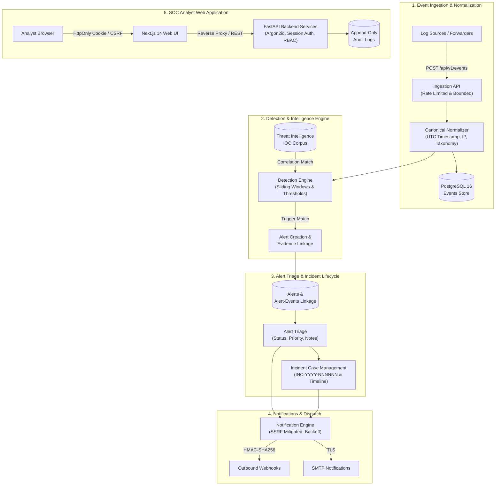

# SentinelForge

[](https://github.com/DevZenMaster/SentinelForge/releases)
[](https://www.python.org/)
[](https://nextjs.org/)
[](https://www.postgresql.org/)
[](LICENSE)
[](SECURITY.md)

SentinelForge is an enterprise-grade, lightweight Security Information and Event Management (SIEM) and Security Operations Center (SOC) platform engineered with defense-in-depth principles, deterministic detection pipelines, and modern DevSecOps standards.

---

## Overview

Modern security teams require transparent, auditable, and resilient detection pipelines without the opacity and operational overhead of monolithic SIEM solutions. SentinelForge bridges this gap by delivering a decoupled, high-performance security operations suite designed for verifiable telemetry processing:

- **Predictable, Deterministic Detections**: Eliminates hallucinations and unexplainable black-box scoring by relying on deterministic, sliding-window rule evaluation and exact correlation logic.
- **Strict Evidence Chain & Forensic Integrity**: Preserves unbroken provenance between raw ingested events, canonical security observables, triggered alerts, and incident case files with database-level referential integrity.
- **Fail-Closed Defensive Posture**: Enforces cryptographic rigor (Argon2id, HMAC-SHA256), server-authoritative RBAC, anti-CSRF request protection, SSRF-safe outbound webhook delivery, and formula injection sanitization on all exported reports.
- **Real-Time SOC Analyst Console**: A responsive dark-mode analyst interface built with Next.js 14 and Tailwind CSS, featuring live telemetry dashboards, deep alert dossiers, multi-entity investigation graphs, compliance reporting, and user administration.

---

## Current Release

### `v0.1.0` (Initial Public Release)

Version `v0.1.0` represents the first public release of SentinelForge, consolidating a complete end-to-end security operations lifecycle across 15 developmental phases:

- Fully operational event ingestion and canonical normalization pipeline.
- Sliding-window detection engine equipped with baseline threat detection rules.
- Threat intelligence observable repository and automated sighting correlation.
- Complete alert triage lifecycle with forensic dossiers and optimistic concurrency recovery.
- Incident case management with chronological timeline reconstruction.
- Multi-vector security reporting engine with formula-sanitized RFC-4180 CSV exports.
- Multi-provider outbound notification engine with fail-closed SSRF protection.
- Hardened multi-stage non-root container deployment configurations with health and readiness probes.
- Self-service account profile and password management with server-side session revocation.
- Administrative user directory with granular role bindings, last-admin lockout prevention, and forensic note preservation.

---

## Architecture

SentinelForge enforces a unidirectional pipeline separating high-throughput ingestion, data normalization, detection evaluation, forensic alerting, incident response, and external notifications.



---

## Key Capabilities

Every capability in SentinelForge is fully implemented, server-authoritative, and verified by automated test suites.

### 1. Security Event Ingestion & Canonical Normalization
- **Single & Batch Ingestion**: High-throughput endpoints (`POST /api/v1/events` and `POST /api/v1/events/batch`) with strict schema validation.
- **Normalization Guarantees**: Enforces ISO 8601 UTC timestamps, IPv4/IPv6 canonicalization, standardized event taxonomies (`authentication`, `network`, `endpoint`, `file`, `cloud`), and bounded payload size constraints (default 1 MB).
- **Rate-Limiting**: Ingestion endpoints protected against volumetric floods and resource exhaustion via configurable sliding-window limits.

### 2. Deterministic Detection Engine & Rules Baseline
- **Sliding-Window Evaluation**: Time-bucketed evaluation (`time_window_seconds`) with configurable frequency thresholds.
- **Version-Locked Rules**: Detection rules feature immutable version incrementing and exact `(rule_id, rule_version)` provenance on all generated alerts.
- **Baseline Detection Rules**:
  - `RULE-001` (High): Brute Force Login (5 failed authentications from same IP in 5 minutes).
  - `RULE-002` (High): Account Attack (10 failed authentications against same username in 10 minutes).
  - `RULE-003` (High): Suspicious Successful Login (Failed logins followed by success from same IP).
  - `RULE-004` (Medium): HTTP Authentication Abuse (Repeated 401 Unauthorized responses).
  - `RULE-005` (High): Network Port Scan Pattern (Connection attempts targeting multiple ports).

### 3. Threat Intelligence & Indicator Correlation
- **Observable Lifecycle**: Manage indicators of compromise (`IP`, `DOMAIN`, `HASH_SHA256`, `URL`) with confidence ratings, expiration tracking, and active status toggles.
- **Automated Sighting Pipeline**: Real-time matching between ingested event observables and the threat intelligence database, enriching alerts with actionable context.

### 4. Alert Management, Evidence Dossiers & Triage
- **Immutable Evidence Linking**: Direct, relational association between alerts and raw triggering events via `alert_events` join tables.
- **Deterministic State Machine**: Lifecycle transitions strictly governed by:
  `OPEN` &rarr; `ACKNOWLEDGED` &rarr; `IN_PROGRESS` &rarr; `SUPPRESSED` &rarr; `RESOLVED` &rarr; `CLOSED`.
- **Analyst Triage Operations**: Active-user assignment, priority override, sanitized append-only triage notes (`alert_notes`), and suppression expiry safety.
- **Optimistic Concurrency Control**: Integer version tracking (`version`) on alert records prevents race conditions, serving interactive HTTP 409 Conflict recovery prompts in the web console.

### 5. Incident Response & Chronological Timelines
- **Case Management**: Formally structured security incidents identified by sequential human-readable identifiers (`INC-YYYY-NNNNNN`).
- **Multi-Alert Correlation**: Link multiple related alerts across different detection vectors into a unified incident workspace.
- **Chronological Timeline Reconstruction**: Unified timeline separating telemetric occurrence timestamps from analyst investigation actions.
- **Containment Tracking**: Incident states track triage progress (`OPEN`, `IN_PROGRESS`, `RESOLVED`, `CLOSED`, `REOPENED`) alongside containment statuses.

### 6. Investigation Analytics & Security Reporting
- **Cross-Entity Correlation**: Graph and pivot capabilities exploring shared IP addresses, user accounts, and affected hosts across alerts and events.
- **9 Specialized Report Categories**: Operations summary, alert lifecycle SLA metrics, incident volume telemetry, rule health distributions, threat intelligence sightings, SLA breach breakdowns, non-evaluative analyst telemetry, security audit aggregates, and objective compliance control evidence (`CTRL-AUD-01` through `CTRL-INC-01`).
- **Formula-Sanitized RFC-4180 CSV Export**: Neutralizes spreadsheet formula injection attacks (CWE-1236) by prefixing sensitive leading characters (`=`, `+`, `-`, `@`, `\t`, `\r`) with a single quote (`'`).
- **Immutable Export Auditing**: Generates `REPORT_EXPORTED` audit log entries for every executed data export.

### 7. Security Notifications & Webhook Integrations
- **Multi-Provider Dispatch**: Real-time notification dispatch supporting generic outbound `WEBHOOK` integrations and transactional `EMAIL` (SMTP).
- **Fail-Closed SSRF Defenses**: Target hostnames resolved via `socket.getaddrinfo` to block loopback (`127.0.0.0/8`, `::1`), private RFC 1918 networks (`10.0.0.0/8`, `172.16.0.0/12`, `192.168.0.0/16`), link-local addresses (`169.254.0.0/16`), and cloud metadata services. HTTP redirects are strictly disabled, and HTTPS is enforced in production.
- **Cryptographic Payload Signing**: Outbound webhook requests include HMAC-SHA256 signatures (`X-SentinelForge-Signature`) with companion timestamp headers (`X-SentinelForge-Timestamp`) to prevent replay attacks.
- **Resilient Delivery Pipeline**: Bounded exponential backoff with jitter, retry capping, and background task crash recovery.

### 8. User Settings & Administrative User Management
- **Self-Service User Settings (`/settings`)**: Authenticated users can update display names, modify usernames (with regex validation), and change passwords with current-password verification.
- **Session Revocation**: Changing a password automatically revokes all other active sessions while preserving the current analyst session.
- **Admin User Management (`/admin/users`)**: Administrators can list users, inspect role assignments, create new accounts, toggle activation states, and manage permissions.
- **Last-Admin Lockout Protection**: Server-authoritative validation prevents administrators from demoting, deactivating, or deleting the final remaining active administrator.
- **Forensic Note Preservation**: Respects referential integrity (`ON DELETE RESTRICT`) on forensic records; attempting to delete a user who authored alert or incident notes safely rejects with HTTP 409, guiding administrators to deactivate the account instead.

### 9. Server-Side RBAC & Append-Only Audit Logging
- **Three-Tier Role Model**:
  - `ADMIN`: Full administrative control, user provisioning, system policy configuration, and export auditing.
  - `ANALYST`: Alert triage, incident case investigation, rule creation, and note authoring.
  - `VIEWER`: Read-only operational visibility across dashboards, alerts, and reports.
- **Tamper-Evident Audit Trail**: Append-only `audit_logs` capturing actor identity, action type, resource ID, IP address, user agent, before/after diffs, and UTC timestamps.

---

## Technology Stack

| Layer | Component | Version / Library | Rationale |
| :--- | :--- | :--- | :--- |
| **Backend API** | FastAPI | `0.115.0+` | High-performance asynchronous REST API with native OpenAPI documentation |
| **Runtime** | Python | `3.13+` | Modern asynchronous language features and performance enhancements |
| **Data Validation** | Pydantic v2 | `2.9.2+` | Strict type enforcement, schema validation, and fail-closed settings parsing |
| **Database & ORM** | PostgreSQL & SQLAlchemy 2.0 | `16` / `2.0.35+` | Robust relational integrity, ACID compliance, and asynchronous connection pooling (`asyncpg`) |
| **Migrations** | Alembic | `1.13.3+` | Versioned, auditable, and automated database schema migrations |
| **Cryptography** | Argon2id & PyJWT | `argon2-cffi` / `PyJWT` | Memory-hard password hashing and cryptographically signed session tokens |
| **Frontend UI** | Next.js 14 App Router | `14.2.15` | Server-rendered and client-hydrated responsive SOC console |
| **Frontend Logic** | React 18 & TypeScript | `18.3.1` / `5.5.4` | Strict type safety, component-driven UI, and deterministic state handling |
| **Styling** | Tailwind CSS | `3.4.11` | Utility-first, responsive dark-mode styling optimized for SOC operations |
| **Icons & Visuals** | Lucide React | `0.400.0` | Accessible, consistent cybersecurity iconography |
| **Containerization** | Docker & Compose | Multi-stage | Hardened non-root runtime containers (UID `10001` / UID `1001`) with health probes |

---

## Security Controls & Invariants

SentinelForge operates under strict security invariants embedded directly into the codebase:

1. **Zero Hardcoded Secrets**: Configuration is loaded strictly from environment variables via Pydantic Settings.
2. **Fail-Closed Production Validation**: The API terminates startup immediately if weak secret keys, default passwords, enabled debug flags, or unencrypted cookies are detected when `ENVIRONMENT=production`.
3. **Argon2id Password Storage**: Passwords are never stored in plaintext and never logged or serialized. Minimum password length is enforced (12 characters).
4. **Anti-CSRF Architecture**: Sensitive state-changing endpoints validate the `X-Requested-With: XMLHttpRequest` custom header alongside strict SameSite/HttpOnly session cookies.
5. **Constant-Time Cryptographic Verification**: Secret comparisons and token signatures utilize constant-time comparison algorithms (`hmac.compare_digest`) to prevent timing attacks.
6. **Defense Against Denial-of-Service**: Strict payload size limits (1 MB for event ingestion, 64 KB for webhooks) and rate-limiting protect backend services from resource starvation.
7. **SSRF Mitigation**: Webhook dispatchers block all private RFC 1918, loopback, link-local, and cloud metadata CIDRs.
8. **Forensic Record Preservation**: Strict foreign key constraints prevent cascading deletion of forensic evidence, preserving the historical chain of custody.

---

## Project Structure

```text
SentinelForge/
├── apps/
│   ├── api/                             # FastAPI Backend Service
│   │   ├── app/
│   │   │   ├── api/                     # API Routers & Dependencies
│   │   │   │   ├── deps.py              # RBAC & Authentication Dependencies
│   │   │   │   └── v1/                  # Versioned API Endpoints (v1)
│   │   │   ├── core/                    # Core Configuration, Security & Errors
│   │   │   ├── db/                      # SQLAlchemy Engine & Session Factory
│   │   │   ├── detection/               # Deterministic Detection Engine
│   │   │   ├── models/                  # Declarative SQLAlchemy ORM Models
│   │   │   ├── schemas/                 # Pydantic Schemas & Request Envelopes
│   │   │   ├── services/                # Encapsulated Business Logic & Services
│   │   │   └── tests/                   # Pytest Automated Test Suite (289 tests)
│   │   ├── migrations/                  # Alembic Database Migrations
│   │   └── pyproject.toml               # Python Dependencies & Packaging
│   └── web/                             # Next.js 14 Frontend Application
│       ├── app/                         # Next.js App Router Workspaces
│       │   ├── admin/users/             # Administrative User Management
│       │   ├── alerts/                  # Alert Triage Operations & Dossiers
│       │   ├── audit/                   # Security Audit Trail
│       │   ├── dashboard/               # SOC Operations Dashboard
│       │   ├── detection-rules/         # Rules Catalog & Editor
│       │   ├── events/                  # Canonical Event Log Viewer
│       │   ├── incidents/               # Incident Case Management & Timeline
│       │   ├── integrations/            # Webhook & Email Integrations
│       │   ├── investigations/          # Multi-Entity Investigation Analytics
│       │   ├── notification-policies/   # Declarative Notification Rules
│       │   ├── notifications/           # Dispatch Log & Retry Telemetry
│       │   ├── reports/                 # Security Reporting & CSV Export
│       │   └── settings/                # User Self-Service Account Settings
│       ├── components/                  # Reusable UI Primitives & Navigation
│       ├── lib/                         # API Client & Authentication Handlers
│       ├── tests/                       # Vitest Automated Test Suite (32 tests)
│       └── package.json                 # Frontend Dependencies & Scripts
├── docs/                                # Technical Documentation
│   ├── api/                             # OpenAPI & Endpoint Specifications
│   ├── architecture/                    # System & Security Architecture
│   └── operations/                      # Runbooks, Deployment & Backup Guides
├── infrastructure/
│   └── docker/                          # Hardened Container Dockerfiles
├── scripts/                             # Utility Scripts (Backup Verification)
├── .env.example                         # Environment Configuration Template
├── .gitignore                           # Git Exclusion Rules
├── docker-compose.yml                   # Production-Ready Multi-Container Setup
├── LICENSE                              # MIT License
├── README.md                            # Project Documentation
├── SECURITY.md                          # Vulnerability Disclosure Policy
└── THREAT-MODEL.md                      # Comprehensive Threat Model & Mitigations
```

---

## Getting Started & Local Setup

### Prerequisites

- **Docker & Docker Compose** (recommended) OR:
- **Python**: `3.13+`
- **Node.js**: `v20+` and `pnpm` (`v9+`)
- **PostgreSQL**: `16+`

---

### Option 1: Quick Start with Docker Compose (Recommended)

The easiest way to run SentinelForge locally with all services, database migrations, and initial seed data is via Docker Compose:

1. **Clone the repository**:
   ```bash
   git clone https://github.com/DevZenMaster/SentinelForge.git
   cd SentinelForge
   ```

2. **Configure environment variables**:
   ```bash
   cp .env.example .env
   ```

3. **Start the platform**:
   ```bash
   docker compose up --build -d
   ```

4. **Verify container health**:
   ```bash
   docker compose ps
   ```
   All three containers (`sentinelforge-postgres`, `sentinelforge-api`, and `sentinelforge-web`) will transition to `healthy`.

5. **Access the platform**:
   - **Analyst Web Console**: `http://localhost:3000`
   - **Backend API & Swagger Docs**: `http://localhost:8000/docs`
   - **API Health Check**: `http://localhost:8000/live`

Default administrator credentials provisioned during initial startup:
- **Username**: `admin`
- **Password**: `AdminSentinel_2026_Secure!`

---

### Option 2: Native Local Development

#### 1. Database Setup
Start a local PostgreSQL 16 instance and create the database:
```sql
CREATE DATABASE sentinelforge_db;
CREATE USER sentinelforge WITH PASSWORD 'sentinel_dev_password_change_me';
GRANT ALL PRIVILEGES ON DATABASE sentinelforge_db TO sentinelforge;
```

#### 2. Backend Service Setup (`apps/api`)
```bash
cd apps/api

# Create and activate Python virtual environment
python3 -m venv .venv
source .venv/bin/activate

# Install dependencies
pip install -e ".[dev]"

# Configure environment
cp ../../.env.example .env

# Run database migrations
alembic upgrade head

# Bootstrap RBAC roles, detection rules, and initial admin account
python scripts/seed.py

# Start the API development server
uvicorn app.main:app --reload --host 127.0.0.1 --port 8000
```

#### 3. Frontend Service Setup (`apps/web`)
```bash
cd apps/web

# Install frontend dependencies
pnpm install

# Start Next.js development server
pnpm dev
```

Visit `http://localhost:3000` and authenticate with your administrative credentials.

---

## Automated Testing & Quality Gates

SentinelForge maintains rigorous quality gates with comprehensive automated test coverage across both backend and frontend codebases.

### Backend Test Suite (Pytest)
The backend test suite verifies authentication, RBAC boundaries, ingestion validation, detection rules, alert triage, incident workflows, reporting exports, webhook delivery, and production configuration invariants:
```bash
cd apps/api
source .venv/bin/activate
pytest app/tests -v
```
*Current test coverage: **289 passing tests**, 0 failures.*

### Frontend Test Suite (Vitest)
The frontend test suite verifies component rendering, authentication state machines, alert triage interactions, reporting views, notification forms, and user settings workflows:
```bash
cd apps/web
pnpm test
```
*Current test coverage: **32 passing tests**, 0 failures.*

### Static Analysis & Type Checking
```bash
# Backend linting and formatting
cd apps/api
ruff check app/
mypy app/

# Frontend type checking and linting
cd apps/web
pnpm typecheck
pnpm lint
```

---

## Responsible Disclosure & Security Policy

Security reports and vulnerability disclosures are treated with the highest priority and evaluated under standard Coordinated Vulnerability Disclosure (CVD) principles.

If you discover a potential vulnerability in SentinelForge:
1. **Do not** open a public GitHub issue.
2. Review our security guidelines in [SECURITY.md](SECURITY.md).
3. Disclose your findings responsibly to the maintainers as outlined in the security policy.

For a detailed analysis of our system threat model, trust boundaries, and mitigations (covering threats T-01 through T-80), refer to [THREAT-MODEL.md](THREAT-MODEL.md).

---

## License

SentinelForge is released under the terms of the [MIT License](LICENSE).

Copyright &copy; 2026 SentinelForge Contributors.
