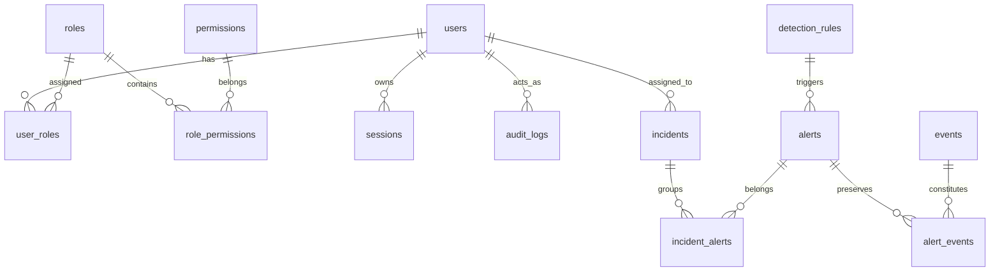

# SentinelForge System Architecture

## 1. System Overview

SentinelForge is structured as a modern multi-tier SOC security analytics platform consisting of:
1. **Log Ingestion & Normalization Layer**: Ingests raw structured events, sanitizes inputs, canonicalizes IP and timestamps, and writes to durable storage.
2. **Deterministic Detection Engine**: Evaluates normalized incoming events against active detection rules using temporal sliding window queries.
3. **Alert & Incident Response Subsystem**: Manages the lifecycle of security alerts, ties immutable event evidence, and groups correlated alerts into actionable incident tickets.
4. **Role-Based Access Control & Audit Subsystem**: Restricts functionality according to least privilege (`ADMIN`, `ANALYST`, `VIEWER`) and writes immutable audit logs.
5. **Security Analyst SOC Frontend**: High-density, accessible Next.js 15 web application designed for security operations personnel.

---

## 2. Logical Component Diagram

```text
       +-----------------------------------------------------------+
       |                       External World                      |
       |  (Servers, Firewalls, Web Apps, Auth Gateways, APIs)       |
       +-----------------------------------------------------------+
                                     |
                                     | HTTPS JSON (POST /api/v1/events)
                                     v
       +-----------------------------------------------------------+
       |               SentinelForge Backend (FastAPI)              |
       |                                                           |
       |  [API Router Layer]                                       |
       |    - Auth (/auth)                                         |
       |    - Events Ingestion (/events)                           |
       |    - Alerts Management (/alerts)                          |
       |    - Incident Workflow (/incidents)                       |
       |    - Rules Management (/rules)                            |
       |    - Audit Logs (/audit)                                  |
       |                                                           |
       |  [Service & Processing Layer]                             |
       |    - Normalization Service (UTC timestamp, IP format)     |
       |    - Validation Service (Pydantic models)                 |
       |    - Detection Engine (Deterministic window checks)       |
       |    - Alert Service (Deduplication, state transitions)     |
       |    - Incident Service (Correlation, analyst workflow)     |
       |    - RBAC Guard (Permission resolution & enforcement)     |
       |    - Audit Logger (Append-only mutation recorder)         |
       |                                                           |
       |  [Data Access Layer]                                      |
       |    - SQLAlchemy 2.0 Async ORM                             |
       +-----------------------------------------------------------+
                                     |
                                     | Async Driver (asyncpg)
                                     v
       +-----------------------------------------------------------+
       |                  PostgreSQL 16 Database                   |
       |                                                           |
       |  - users, roles, permissions, user_roles                  |
       |  - sessions                                               |
       |  - events (indexed by time, IP, user, type)               |
       |  - detection_rules                                        |
       |  - alerts, alert_events (evidence)                        |
       |  - incidents, incident_alerts                             |
       |  - audit_logs (append-only)                               |
       +-----------------------------------------------------------+
                                     ^
                                     | REST API / JSON
       +-----------------------------------------------------------+
       |               SentinelForge Web UI (Next.js)               |
       |                                                           |
       |  - SOC Analytics Dashboard (Live database metrics)        |
       |  - Event Explorer (Indexed search, multi-filter)          |
       |  - Alert Investigation Console (Evidence timeline)        |
       |  - Incident Workbench (Containment & triage workflow)     |
       |  - Rule Management & Tuning                               |
       |  - Audit Trail Inspector                                  |
       +-----------------------------------------------------------+
```

---

## 3. Database Schema Overview



---

## 4. Ingestion & Detection Lifecycle

1. **Ingestion**: Client sends batch or single event payload via `POST /api/v1/events`.
2. **Validation**: Payload validated against Pydantic schema (types, field bounds, valid event taxonomies).
3. **Normalization**:
   - Timestamp parsed and cast to UTC ISO-8601.
   - IP representations canonicalized.
   - Action names converted to lowercase slug standard.
4. **Persistence**: Event saved to PostgreSQL `events` table with generated UUID and indexing.
5. **Detection Evaluation**:
   - Active rules relevant to the `event_type` and `action` are loaded.
   - Sliding window criteria are evaluated against recent event history.
   - If conditions are met:
     - An `Alert` record is generated with severity, rule metadata, and timestamps.
     - Evidence rows are created in `alert_events` linking all matching events.
6. **Audit & Alerting**: Alert enters `OPEN` status and is visible on analyst dashboard.
