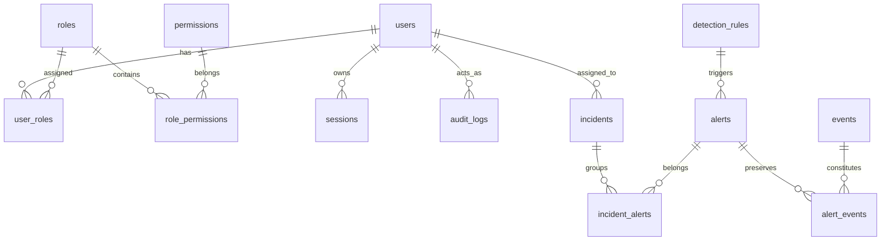

# SentinelForge System Architecture

## 1. System Overview

SentinelForge is structured as a modern multi-tier SOC security analytics platform consisting of:
1. **Log Ingestion & Normalization Layer**: Ingests raw structured events, sanitizes inputs, canonicalizes IP and timestamps, and writes to durable storage.
2. **Deterministic Detection Engine**: Evaluates normalized incoming events against active detection rules using temporal sliding window queries.
3. **Alert & Incident Response Subsystem**: Manages the lifecycle of security alerts, ties immutable event evidence, and groups correlated alerts into actionable incident tickets.
4. **Role-Based Access Control & Audit Subsystem**: Restricts functionality according to least privilege (`ADMIN`, `ANALYST`, `VIEWER`) and writes immutable audit logs.
5. **Security Analyst SOC Frontend**: High-density, accessible Next.js 15 web application designed for security operations personnel.

---

## 2. Logical Component Diagram

```text
       +-----------------------------------------------------------+
       |                       External World                      |
       |  (Servers, Firewalls, Web Apps, Auth Gateways, APIs)       |
       +-----------------------------------------------------------+
                                     |
                                     | HTTPS JSON (POST /api/v1/events)
                                     v
       +-----------------------------------------------------------+
       |               SentinelForge Backend (FastAPI)              |
       |                                                           |
       |  [API Router Layer]                                       |
       |    - Auth (/auth)                                         |
       |    - Events Ingestion (/events)                           |
       |    - Alerts Management (/alerts)                          |
       |    - Incident Workflow (/incidents)                       |
       |    - Rules Management (/rules)                            |
       |    - Audit Logs (/audit)                                  |
       |                                                           |
       |  [Service & Processing Layer]                             |
       |    - Normalization Service (UTC timestamp, IP format)     |
       |    - Validation Service (Pydantic models)                 |
       |    - Detection Engine (Deterministic window checks)       |
       |    - Alert Service (Deduplication, state transitions)     |
       |    - Incident Service (Correlation, analyst workflow)     |
       |    - RBAC Guard (Permission resolution & enforcement)     |
       |    - Audit Logger (Append-only mutation recorder)         |
       |                                                           |
       |  [Data Access Layer]                                      |
       |    - SQLAlchemy 2.0 Async ORM                             |
       +-----------------------------------------------------------+
                                     |
                                     | Async Driver (asyncpg)
                                     v
       +-----------------------------------------------------------+
       |                  PostgreSQL 16 Database                   |
       |                                                           |
       |  - users, roles, permissions, user_roles                  |
       |  - sessions                                               |
       |  - events (indexed by time, IP, user, type)               |
       |  - detection_rules                                        |
       |  - alerts, alert_events (evidence)                        |
       |  - incidents, incident_alerts                             |
       |  - audit_logs (append-only)                               |
       +-----------------------------------------------------------+
                                     ^
                                     | REST API / JSON
       +-----------------------------------------------------------+
       |               SentinelForge Web UI (Next.js)               |
       |                                                           |
       |  - SOC Analytics Dashboard (Live database metrics)        |
       |  - Event Explorer (Indexed search, multi-filter)          |
       |  - Alert Investigation Console (Evidence timeline)        |
       |  - Incident Workbench (Containment & triage workflow)     |
       |  - Rule Management & Tuning                               |
       |  - Audit Trail Inspector                                  |
       +-----------------------------------------------------------+
```

---

## 3. Database Schema Overview



---

## 4. Ingestion & Detection Lifecycle

1. **Ingestion Request**: Authenticated client sends single event payload via `POST /api/v1/events` (guarded by `events.create` permission; ANALYST and ADMIN allowed, VIEWER rejected with 403).
2. **Security Controls & Rate Limiting**:
   - Request correlation ID extracted and sanitized against regex `^[a-zA-Z0-9_\-:.]{1,64}$` to prevent log injection.
   - Payload size checked (`Content-Length <= MAX_EVENT_PAYLOAD_BYTES`, default 1MB; returns 413).
   - Sliding-window rate limiting applied per IP and user (`EVENTS_RATE_LIMIT_PER_MINUTE=1000`; returns 429).
3. **Strict Validation**:
   - Timezone-aware UTC timestamp validated within sanity bounds (future <= 5m, past <= 365d).
   - IPv4 / IPv6 addresses validated via standard library `ipaddress` without DNS lookups.
   - Destination port bounds verified (0-65535).
   - Controlled severity enum and supported source types enforced.
4. **Idempotency & Concurrency**:
   - Checked via `external_event_id` or `Idempotency-Key` header.
   - In-process coordination and database-level `UNIQUE` index on `external_event_id` prevent duplicate persistence.
   - Replay of existing `external_event_id` returns `200 OK` with `status: "duplicate"` and original `event_id` and `ingested_at`.
5. **Persistence & Evidentiary Integrity**:
   - Full original log payload stored verbatim in `raw_payload` (PostgreSQL `JSONB`) without stripping or mutation.
   - Event committed to PostgreSQL `events` table with compound temporal indexes.
   - Append-only audit log records `EVENT_INGEST_SUCCESS` or `EVENT_INGEST_DUPLICATE` (sanitized without raw payload).
6. **Normalization & Canonicalization Pipeline (Phase 4)**:
   - **Deterministic Dispatcher**: Dispatches event to specialized registered parser (`LinuxAuthParser`, `WebParser`) with fallback to `GenericParser`.
   - **Evidence Immutability**: The ingested `raw_payload` (JSONB) is treated as strictly read-only and preserved verbatim.
   - **Canonical Taxonomy**: Extracts canonical attributes (`outcome`, `event_type`, `action`, `severity`, `source_ip`, `destination_ip`, `source_port`, `destination_port`, `username`, `message`) directly into query-indexed table columns.
   - **Extensible Attributes**: Preserves unmapped telemetry in `attributes` (PostgreSQL `JSONB`).
   - **Traceability & Diagnostics**: Stores `parser_name`, `parser_version`, `normalization_version`, `normalized_at`, `normalization_status` (`NORMALIZED`, `PARTIAL`, `FAILED`), and diagnostic `normalization_errors`.
   - **Reprocessing**: `POST /api/v1/events/{id}/normalize` allows analysts to re-evaluate raw telemetry as parser capabilities improve.
7. **Detection Engine (Phase 5)**:
   - Sliding window temporal queries against canonical columns and compound indexes (`ix_events_event_type_action_timestamp`, `ix_events_timestamp_source_ip`, `ix_events_timestamp_username`).
   - Evaluates canonical outcomes (`failure`, `success`) to generate correlated `Alert` entities.
