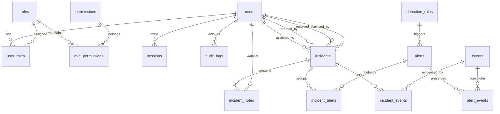

# SentinelForge System Architecture

## 1. System Overview

SentinelForge is structured as a modern multi-tier SOC security analytics platform consisting of:
1. **Log Ingestion & Normalization Layer**: Ingests raw structured events, sanitizes inputs, canonicalizes IP and timestamps, and writes to durable storage.
2. **Deterministic Detection Engine**: Evaluates normalized incoming events against active detection rules using temporal sliding window queries.
3. **Alert & Incident Response Subsystem**: Manages the lifecycle of security alerts, ties immutable event evidence, and groups correlated alerts into actionable incident tickets.
4. **Role-Based Access Control & Audit Subsystem**: Restricts functionality according to least privilege (`ADMIN`, `ANALYST`, `VIEWER`) and writes immutable audit logs.
5. **Security Analyst SOC Frontend**: High-density, accessible Next.js 15 web application designed for security operations personnel.

---

## 2. Logical Component Diagram

```text
       +-----------------------------------------------------------+
       |                       External World                      |
       |  (Servers, Firewalls, Web Apps, Auth Gateways, APIs)       |
       +-----------------------------------------------------------+
                                     |
                                     | HTTPS JSON (POST /api/v1/events)
                                     v
       +-----------------------------------------------------------+
       |               SentinelForge Backend (FastAPI)              |
       |                                                           |
       |  [API Router Layer]                                       |
       |    - Auth (/auth)                                         |
       |    - Events Ingestion (/events)                           |
       |    - Alerts Management (/alerts)                          |
       |    - Incident Workflow (/incidents)                       |
       |    - Rules Management (/rules)                            |
       |    - Audit Logs (/audit)                                  |
       |                                                           |
       |  [Service & Processing Layer]                             |
       |    - Normalization Service (UTC timestamp, IP format)     |
       |    - Validation Service (Pydantic models)                 |
       |    - Detection Engine (Deterministic window checks)       |
       |    - Alert Service (Deduplication, state transitions)     |
       |    - Incident Service (Correlation, analyst workflow)     |
       |    - RBAC Guard (Permission resolution & enforcement)     |
       |    - Audit Logger (Append-only mutation recorder)         |
       |                                                           |
       |  [Data Access Layer]                                      |
       |    - SQLAlchemy 2.0 Async ORM                             |
       +-----------------------------------------------------------+
                                     |
                                     | Async Driver (asyncpg)
                                     v
       +-----------------------------------------------------------+
       |                  PostgreSQL 16 Database                   |
       |                                                           |
       |  - users, roles, permissions, user_roles                  |
       |  - sessions                                               |
       |  - events (indexed by time, IP, user, type)               |
       |  - detection_rules                                        |
       |  - alerts, alert_events (evidence)                        |
       |  - incidents, incident_alerts                             |
       |  - audit_logs (append-only)                               |
       +-----------------------------------------------------------+
                                     ^
                                     | REST API / JSON
       +-----------------------------------------------------------+
       |               SentinelForge Web UI (Next.js)               |
       |                                                           |
       |  - SOC Analytics Dashboard (Live database metrics)        |
       |  - Event Explorer (Indexed search, multi-filter)          |
       |  - Alert Investigation Console (Evidence timeline)        |
       |  - Incident Workbench (Containment & triage workflow)     |
       |  - Rule Management & Tuning                               |
       |  - Audit Trail Inspector                                  |
       +-----------------------------------------------------------+
```

---

## 3. Database Schema Overview



---

## 4. Ingestion & Detection Lifecycle

1. **Ingestion Request**: Authenticated client sends single event payload via `POST /api/v1/events` (guarded by `events.create` permission; ANALYST and ADMIN allowed, VIEWER rejected with 403).
2. **Security Controls & Rate Limiting**:
   - Request correlation ID extracted and sanitized against regex `^[a-zA-Z0-9_\-:.]{1,64}$` to prevent log injection.
   - Payload size checked (`Content-Length <= MAX_EVENT_PAYLOAD_BYTES`, default 1MB; returns 413).
   - Sliding-window rate limiting applied per IP and user (`EVENTS_RATE_LIMIT_PER_MINUTE=1000`; returns 429).
3. **Strict Validation**:
   - Timezone-aware UTC timestamp validated within sanity bounds (future <= 5m, past <= 365d).
   - IPv4 / IPv6 addresses validated via standard library `ipaddress` without DNS lookups.
   - Destination port bounds verified (0-65535).
   - Controlled severity enum and supported source types enforced.
4. **Idempotency & Concurrency**:
   - Checked via `external_event_id` or `Idempotency-Key` header.
   - In-process coordination and database-level `UNIQUE` index on `external_event_id` prevent duplicate persistence.
   - Replay of existing `external_event_id` returns `200 OK` with `status: "duplicate"` and original `event_id` and `ingested_at`.
5. **Persistence & Evidentiary Integrity**:
   - Full original log payload stored verbatim in `raw_payload` (PostgreSQL `JSONB`) without stripping or mutation.
   - Event committed to PostgreSQL `events` table with compound temporal indexes.
   - Append-only audit log records `EVENT_INGEST_SUCCESS` or `EVENT_INGEST_DUPLICATE` (sanitized without raw payload).
6. **Normalization & Canonicalization Pipeline (Phase 4)**:
   - **Deterministic Dispatcher**: Dispatches event to specialized registered parser (`LinuxAuthParser`, `WebParser`) with fallback to `GenericParser`.
   - **Evidence Immutability**: The ingested `raw_payload` (JSONB) is treated as strictly read-only and preserved verbatim.
   - **Canonical Taxonomy**: Extracts canonical attributes (`outcome`, `event_type`, `action`, `severity`, `source_ip`, `destination_ip`, `source_port`, `destination_port`, `username`, `message`) directly into query-indexed table columns.
   - **Extensible Attributes**: Preserves unmapped telemetry in `attributes` (PostgreSQL `JSONB`).
   - **Traceability & Diagnostics**: Stores `parser_name`, `parser_version`, `normalization_version`, `normalized_at`, `normalization_status` (`NORMALIZED`, `PARTIAL`, `FAILED`), and diagnostic `normalization_errors`.
   - **Reprocessing**: `POST /api/v1/events/{id}/normalize` allows analysts to re-evaluate raw telemetry as parser capabilities improve.
7. **Detection Engine & Rule Evaluation (Phase 5)**:
   - **Deterministic Rules Catalog**: Registered rules (`RULE-001` to `RULE-005`) evaluate canonical event types (`authentication`, `web`, `network`).
   - **Sliding-Window Query Engine**: Context-bounded temporal queries (`[timestamp - window_seconds, timestamp]`) executed across compound indexes (`ix_events_source_ip_timestamp`, `ix_events_username_timestamp`, `ix_events_event_type_action_timestamp`).
   - **Query Safety**: Hard limit (default 1000 events) and parameterized SQL prevent memory exhaustion and SQL injection.
   - **Deterministic Alert Deduplication**: `dedup_key = {rule_id}:{correlation_key}:{bucket}` backed by database unique constraint `uq_alerts_dedup_key`.
   - **Evidence Linking**: `AlertEvent` join table preserves immutable relationships linking alerts to constituent events without mutating raw event logs (`ForeignKey(events.id, ondelete=RESTRICT)`).
   - **Fault Isolation**: Rule evaluation failures are isolated via individual exception boundaries; errors never impede other rules or abort event ingestion.
   - **Execution Lifecycle**: Synchronous evaluation triggered during ingestion and reprocessing, plus on-demand evaluation via `POST /api/v1/events/{id}/detect`.
   - **Alert Management API**: `GET /api/v1/alerts` and `GET /api/v1/alerts/{id}` provide paginated inspection and forensic evidence exploration.
8. **Incident Management & Security Investigation Subsystem (Phase 6)**:
   - **Case File Architecture**: Incidents aggregate correlated alerts and raw telemetry into forensic investigation cases with human-readable sequential identifiers (`incident_id: INC-YYYY-NNNNNN`).
   - **Severity vs. Priority Decoupling**: Distinguishes intrinsic security impact (`severity`: `LOW`, `MEDIUM`, `HIGH`, `CRITICAL`) from triage urgency (`priority`: `LOW`, `MEDIUM`, `HIGH`, `URGENT`).
   - **Strict Lifecycle State Machine**: Controlled transitions across `OPEN`, `IN_PROGRESS`, `RESOLVED`, `CLOSED`, and `REOPENED`. Invalid state jumps return `400 Bad Request`.
     - `OPEN -> IN_PROGRESS`: Triggered manually or automatically upon analyst assignment.
     - `IN_PROGRESS -> RESOLVED`: Requires `resolution_category` (`TRUE_POSITIVE_BENIGN`, `TRUE_POSITIVE_MALICIOUS`, `FALSE_POSITIVE`, `DUPLICATE`, `OTHER`) and non-empty `resolution_notes`. Sets `resolved_at` and `resolved_by_user_id`.
     - `RESOLVED -> CLOSED`: Requires dedicated `incidents.close` permission (`ADMIN` only by default). Sets `closed_at` and `closed_by_user_id`.
     - `RESOLVED / CLOSED -> REOPENED`: Requires non-empty `reopen_reason`. Clears resolution and closure timestamps.
   - **Multi-Alert & Direct Event Evidentiary Linking**:
     - Alerts associated via `IncidentAlert` join table with duplicate prevention (`uq_incident_alerts_incident_alert`).
     - Raw security events directly linked via `IncidentEvent` join table (`uq_incident_events_incident_event`) enforced with `ForeignKey("events.id", ondelete="RESTRICT")`, ensuring raw evidence cannot be dropped while linked to active cases.
   - **Tamper-Evident Investigation Notes**: `IncidentNote` entries capture forensic commentary (1-10,000 characters), strictly attributing `author_user_id` from the authenticated server session. Note bodies are omitted from audit log payloads to preserve privacy while maintaining full action auditability.
   - **Unified Investigation Timeline**: Chronologically interleaves alerts, direct evidence events, notes, assignments, and status transitions, strictly differentiating underlying telemetric occurrence timestamps (`occurred_at`) from SOC operational action timestamps (`action_at`).
   - **Granular RBAC**: Enforces `incidents.read`, `incidents.create`, `incidents.update`, and `incidents.close` across role boundaries (`ADMIN` and `ANALYST` can triage/mutate; `VIEWER` is read-only).
9. **Threat Intelligence & IOC Enrichment Subsystem (Phase 7)**:
   - Normalized IOC catalog (`indicators`) and enrichment evidence (`threat_intelligence`, `indicator_events`).
   - Passive evidence token model avoiding SSRF or outbound HTTP requests.
10. **Security Investigation & Correlation Analytics (Phase 8)**:
    - 360-degree investigation context, bounded multi-entity correlation graph traversal, and chronological timeline reconstruction anchored on any entity.
11. **Detection Engineering & Rule Management (Phase 9)**:
    - Declarative JSON condition evaluation engine with immutable rule versioning (`v1`, `v2`, ...), draft stages, activation controls, and atomic activation concurrency guards.
12. **Detection Operations, Alert Triage & Security Monitoring (Phase 10)**:
    - **Operational Alert Lifecycle & State Machine**: Deterministic state machine governing alert lifecycle transitions across `OPEN`, `ACKNOWLEDGED`, `IN_PROGRESS`, `SUPPRESSED`, `RESOLVED`, and `CLOSED`. Invalid state transitions and duplicate state transitions are rejected with HTTP 400.
    - **Analyst Assignment & Ownership**: Validates target analyst accounts are active; supports assignment, reassignment, and unassignment with full operational audit logging.
    - **Controlled Suppression**: Bounded suppression mechanism requiring mandatory justification and optional bounded expiration (<= 90 days in the future). Suppressed alerts remain queryable and historically auditable; hard deletes are strictly forbidden.
    - **Append-Only Analyst Triage Notes**: Dedicated `alert_notes` table with HTML sanitization, character bounding (1-10,000 characters), and author attribution bound strictly to the server-verified session.
    - **Deterministic Explainable Prioritization**: Computes factual prioritization metadata (`priority_tier`: `CRITICAL`, `HIGH`, `MEDIUM`, `LOW`, `priority_score`, `sla_breach`, `age_seconds`, `factors`) derived from severity, unacknowledged state, unassigned state, incident linkage, and temporal age. Zero artificial AI/ML or probabilistic scoring.
    - **Incident & Investigation Linkage**: Integrates with Phase 6 incident cases (`attach_alert_to_incident`) and Phase 8 investigation analytics (`ALERT` anchor context).
    - **Forensic Rule Traceability**: Preserves immutable `rule_id` and exact `rule_version` on every alert instance, ensuring historical alerts permanently reflect the detection logic in effect when triggered.
    - **Concurrency & Lost Update Defense**: Combines database row-level locking (`with_for_update()`) and optimistic concurrency version counter (`version`) to prevent lost updates and race conditions during concurrent analyst operations.
    - **Notification-Ready Architecture**: Clean service boundary (`AlertOperationalEvent`, `emit_alert_event`) decoupling triage operations from future notification delivery channels without unnecessary queue infrastructure.
13. **SOC Dashboard & Security Operations Web UI (Phase 11)**:
    - **Analyst-Centric Operational Workspaces**: Dedicated web interfaces covering the full security operations lifecycle:
      - **SOC Operations Dashboard**: Real-time KPI metric cards (active alerts, critical alerts, SLA breached untriaged alerts, active incidents, active detection rules, threat indicators) and live activity streams derived strictly from persisted PostgreSQL state. Zero mock or simulated data.
      - **Alerts & Triage Console**: High-density alerts queue with severity filtering, multi-field search, priority scoring, SLA status badges, analyst assignment, explicit acknowledgement, bounded suppression, and verified resolution workflows.
      - **Alert Detail & Forensic Evidence View**: Complete triage dossier displaying triggering events, immutable rule snapshot, linked incidents, pivot links to investigation analytics, and append-only analyst triage notes.
      - **Incident Case Management**: Case dossiers with severity/priority classification, lead analyst assignment, chronological multi-alert timeline, and controlled state machine transitions.
      - **Investigation Analytics**: Interactive 360-degree forensic exploration anchored on IP addresses, user accounts, alert IDs, incident cases, or threat indicators.
      - **Detection Engineering & Rules Catalog**: Searchable rule catalog displaying immutable published rule versions, evaluation criteria schemas, and status indicators.
      - **Threat Intelligence & IOC Repository**: Structured indicator repository with observable search, confidence ratings, and sighting metrics.
      - **Security Event Telemetry**: Searchable normalized log viewer with verbatim evidentiary raw JSON payload inspector.
      - **Audit Trail Inspector**: Read-only, append-only security log viewer with before/after state diff inspection guarded by `audit.read`.
    - **Frontend Security Controls & Defensive Architecture**:
      - **Authentication & Authoritative RBAC**: HttpOnly session cookie transport; API routes guard actions on the backend using `require_permission`; client UI gating is strictly cosmetic and never trusted for security decisions.
      - **Anti-CSRF Defense**: Mandatory `X-Requested-With: XMLHttpRequest` custom header on all mutating API calls validated by backend middleware.
      - **Stored & Reflected XSS Prevention**: Default React string interpolation and HTML entity escaping; zero use of `dangerouslySetInnerHTML`; telemetry and triage notes rendered strictly as plain text.
      - **Optimistic Concurrency & 409 Conflict Handling**: Client-side version tracking across alert mutations; backend HTTP 409 conflicts caught and surfaced with an interactive reload banner, preventing silent overwrite of concurrent analyst decisions.
      - **Clickjacking Defense & CSP**: Global `X-Frame-Options: DENY`, `X-Content-Type-Options: nosniff`, and strict Content Security Policy headers enforced at the Next.js boundary.
14. **Security Reporting, Metrics & Compliance Operations (Phase 12)**:
    - **Authoritative Persisted Metrics**: Deterministic security metrics computed dynamically from authoritative database records (`alerts`, `incidents`, `detection_rules`, `indicators`, `audit_logs`, `events`). Zero synthetic scoring, zero probabilistic hallucination.
    - **Strict Bounded Query Validation**: Timezone-aware UTC normalization, query window capped to a maximum of 365 days, and rejection of inverted ranges (`start >= end`) or future timestamps with HTTP 422.
    - **Alert Lifecycle & Performance Metrics**: Statistical duration distributions (mean, median, min, max) for Time to Acknowledge, Time to Assign, Time to Resolve, and Time to Close. Missing timestamps are tracked as backlog counters and never converted to zero seconds.
    - **SLA Breach Reporting with Explicit Denominator**: Strictly adheres to Phase 10 definition (`CRITICAL` and `HIGH` severity alerts untriaged >24h). Denominator is explicitly reported alongside breach counts to avoid statistical distortion.
    - **Detection Engineering Provenance**: Grouped alerts preserve exact detection-time `rule_id` and immutable `rule_version`.
    - **Non-Evaluative Analyst Operational Activity**: Auditable activity logs for capacity review; strictly disclaims individual productivity scoring or competence ranking.
    - **Factual Compliance Evidence Model**: Maps observable telemetry to standard control objectives (`CTRL-AUD-01`, `CTRL-AUTH-01`, `CTRL-ALRT-01`, `CTRL-DET-01`, `CTRL-INC-01`) reporting factual counts and evidence states (`EVIDENCE_AVAILABLE` vs `EVIDENCE_MISSING`). Includes explicit disclaimer against third-party certification claims.
    - **CSV Formula Injection Defense (CWE-1236)**: Neutralizes spreadsheet execution tokens (`=`, `+`, `-`, `@`, `\t`, `\r`) by prepending `'` before RFC-4180 serialization with UTF-8 BOM.
    - **Immutable Reporting Audit Trail**: Logs `REPORT_GENERATED` and `REPORT_EXPORTED` with actor attribution, request ID, and query parameters while omitting report data payloads to prevent recursive data leakage.
    - **Web Reporting Console**: Multi-category reporting workspace with date range presets (24h, 7d, 30d, 90d, custom), category tabs, and export triggers gated by server-side RBAC (`reports.read`, `reports.export`, `reports.audit`).
15. **Security Notifications & External Integrations Subsystem (Phase 13)**:
    - **Architectural Placement & Event Pipeline**: Fully decoupled integration delivery subsystem extending the pipeline:
      `Security Events → Ingestion → Normalization → Detection → Alerts → Triage → Investigation → Incidents → Threat Intelligence → Reporting → Notifications / Integrations`.
    - **Destination Providers**:
      - **Webhook Destination**: Dispatches HTTPS POST requests with JSON payloads containing standardized security event metadata. Includes multi-layer fail-closed SSRF protection, configurable timeout (1-30s), and cryptographic request payload signing.
      - **Email Destination**: Dispatches operational HTML and plain-text security notifications via SMTP with TLS/STARTTLS support, contextual data minimization, and HTML entity escaping.
    - **Fail-Closed Server-Side Request Forgery (SSRF) Defense**:
      - Resolves target hostnames via `socket.getaddrinfo` and validates every resolved IP against blocked CIDRs:
        - RFC 1918 Private IPv4 (`10.0.0.0/8`, `172.16.0.0/12`, `192.168.0.0/16`)
        - RFC 1122 Loopback (`127.0.0.0/8`, `::1`)
        - Link-Local (`169.254.0.0/16`, `fe80::/10`)
        - Cloud Metadata IP (`169.254.169.254/32`)
        - Multicast & Carrier-Grade NAT (`224.0.0.0/4`, `100.64.0.0/10`)
      - Disallows HTTP 3xx redirects (`follow_redirects=False`) to defeat redirect-based bypass.
      - Enforces HTTPS scheme in production environments (`ALLOW_HTTP_WEBHOOKS=False`).
    - **Cryptographic Request Signing (HMAC-SHA256)**:
      - Computes HMAC-SHA256 signature using the destination's shared secret over the canonical signing string: `${timestamp}.${payload_body}`.
      - Injects authentication headers:
        - `X-SentinelForge-Signature`: Hex-encoded HMAC-SHA256 digest (`sha256=...`).
        - `X-SentinelForge-Timestamp`: Epoch timestamp (seconds) for replay mitigation.
        - `X-SentinelForge-Event-ID`: Unique UUID of the notification event.
      - Provides constant-time verification utility (`hmac.compare_digest`) with configurable tolerance (default: 300s).
    - **Write-Only Secret Token Architecture**:
      - Shared webhook secret tokens are write-only: never returned in plaintext in API responses, operational logs, or audit records.
      - Responses expose only boolean `is_secret_configured` and masked preview (`••••••••abcd`).
      - In UI forms, secrets are captured via password inputs and never pre-populated on edits.
    - **Declarative Policy Matching & Routing Engine**:
      - Multi-event triggers (`ALERT_CREATED`, `ALERT_ESCALATED`, `ALERT_TRIAGED`, `ALERT_RESOLVED`, `INCIDENT_CREATED`, `INCIDENT_STATUS_CHANGED`, `SLA_BREACH`, `REPORT_EXPORTED`).
      - Severity threshold gating (`CRITICAL`, `HIGH`, `MEDIUM`, `LOW`, `INFO`).
      - Strict declarative JSON filter allowlists (`rule_id`, `rule_version`, `status`, `severity`, `destination_type`, `event_type`).
      - Per-resource cooldown enforcement (`cooldown_seconds` tracked in-memory/per-target) to defeat alert flooding and notification storms.
    - **Deterministic Delivery State Machine & Resilience**:
      - Lifecycle states: `PENDING` → `DELIVERING` → `DELIVERED` | `FAILED` → `RETRYING` → `EXHAUSTED` | `CANCELLED`.
      - Compound idempotency keys (`f"{event_id}:{policy_id}:{destination_id}"`) preventing duplicate dispatches.
      - Exponential backoff with jitter and upstream `Retry-After` header capping (<= 300s).
      - Maximum delivery attempt limit (default: 5 attempts) before transitioning to `EXHAUSTED`.
    - **Transactional Isolation**:
      - Core security operations (alert creation, triage, incident management, report generation) execute in isolated DB transactions. Notification event emission is decoupled and never interrupts, rolls back, or delays core security transactions.
    - **Operational Notification Workspaces**:
      - `/integrations`: Destination catalog with test connectivity modal, enable/disable switches, write-only secret updates, and health status indicators.
      - `/notification-policies`: Declarative routing rule management with event triggers, severity thresholds, destination multi-select, and cooldown configuration.
      - `/notifications`: Real-time delivery logs table with KPI metric counters, latency tracking, delivery attempt counts, manual retry dispatch, and audit inspection modals.
16. **Production Hardening, Observability & Operational Resilience (Phase 14)**:
    - **Fail-Closed Configuration Invariants**: Strict startup validation (`validate_startup_configuration`) terminating the process immediately if `DEBUG=True`, weak/default `SECRET_KEY`, default database passwords, wildcard CORS, or insecure cookie attributes are detected in production environments.
    - **Structured Telemetry & Secret Sanitization**: Contextual JSON logging (`JSONLogFormatter`) with recursive redaction of sensitive credentials, passwords, session tokens, and webhook secrets. Every request is deterministically tracked via validated `X-Request-ID` / `X-Correlation-ID` headers.
    - **Standardized Error Taxonomy & SQL Shielding**: Controlled error envelopes returning standardized machine-readable error codes (`ErrorCode`). Global handlers intercept database exceptions (`DBAPIError`), shielding internal query syntax, connection strings, and filesystem paths from exposure.
    - **Dual-Tier Health & Liveness Probing**:
      - Root-level and API-level `/live` probes confirming process vitality without database queries.
      - `/ready` probes actively querying database connectivity, returning HTTP 503 if PostgreSQL is unreachable.
      - Protected operational metrics endpoint (`GET /api/v1/metrics`) providing low-cardinality telemetry (requests, status codes, latencies, operational counters) secured by RBAC (`audit.read`).
    - **Database Connection Pool Resilience**: Bounded connection pooling with configurable sizing (`DB_POOL_SIZE`, `DB_MAX_OVERFLOW`, `DB_POOL_TIMEOUT`, `DB_POOL_RECYCLE`), automated transaction rollback on unhandled exceptions, and active pre-pinging.
    - **Background Task Resilience & Crash Reconciliation**:
      - Automatic startup reconciliation (`reconcile_stale_deliveries`) sweeping deliveries left stuck in `DELIVERING` after process crashes, resetting them to `RETRYING` or `EXHAUSTED`.
      - Graceful shutdown drain handler awaiting active in-flight notification tasks (10s bounded timeout) prior to connection pool disposal.
    - **Reverse Proxy & Client IP Integrity**: Authoritative client IP resolution (`get_client_ip`) trusting `X-Forwarded-For` only when requests originate from explicitly configured reverse proxies (`TRUSTED_PROXIES`).
    - **Multi-Stage Container Hardening**: Production Dockerfiles running strictly as unprivileged non-root service users (`USER sentinelforge:sentinelforge` UID 10001, `USER nextjs:nodejs` UID 1001) with multi-stage builds, minimal base images, and automated health checks.
    - **Automated CI/CD Quality Gates**: Comprehensive GitHub Actions pipeline enforcing backend tests, linting, strict mypy typing, formatting, frontend tests, Next.js build verification, and migration head checks.
    - **Backup Verification & Operational Runbooks**: Automated read-only verification utility (`scripts/verify_backup_integrity.py`) validating evidentiary completeness across all 21 core tables, supported by production deployment, backup/recovery, and operational runbooks.
